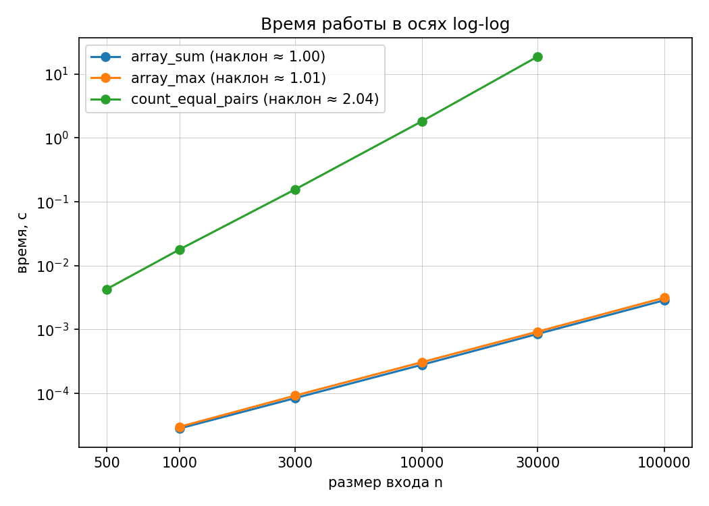
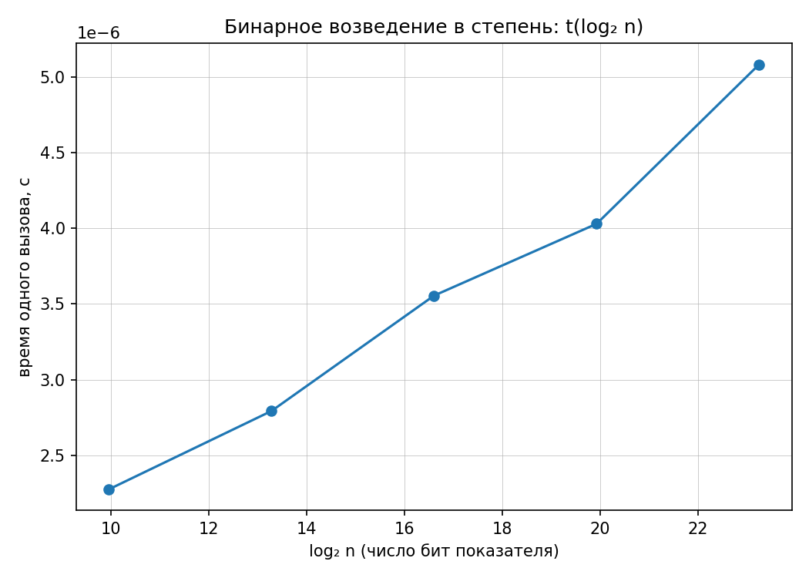

# Отчёт по ЛР 1. Анализ временной сложности элементарных алгоритмов

**Вариант 17** (seed генератора данных = 30 + 17 = **47**)
КИМ-01 — `M1-intro-and-basic-structures/kim-01-complexity-analysis.md`

Код: [`../lab01_complexity.py`](../lab01_complexity.py) · Протокол запуска: [`lab01_run.log`](lab01_run.log)

Работа выполнена на стартовой заготовке КИМ-01: каркас загрузки данных, замеров
и построения графиков оставлен без изменений, заполнены TODO — четыре алгоритма
и собственные проверки инвариантов. Единственная правка каркаса — оформление
делений и сетки на графиках (п. 4.4).

---

## 1. Условия эксперимента

| Параметр | Значение |
| --- | --- |
| Процессор | Intel64 Family 6 Model 158 Stepping 10 (Coffee Lake) |
| ОС | Windows 11, 10.0.26200 |
| Python | CPython 3.11.9 (64 бит) |
| Таймер | `time.perf_counter()` |
| Прогрев | есть, первый запуск не учитывается |
| Повторов на точку | 5, берётся **медиана** |
| Данные | `data/generated`, вариант 17, seed 47, сверка по `manifest.json` |

Порядок воспроизведения:

```bash
python scripts/generate_data.py --variant 17 --only arrays --out data/generated
python lab01_complexity.py --variant 17 --out report
```

Скрипт сверяет `--variant` с паспортом данных и откажется считать на чужих данных.

---

## 2. Реализованные алгоритмы

Все четыре алгоритма написаны вручную, без `sum`, `max` и встроенного `pow` —
они используются только как **эталоны** при верификации (п. 6).

| Алгоритм | Функция | Данные для замера |
| --- | --- | --- |
| Сумма элементов массива | `array_sum` | `arrays_random_*`, n = 10³…10⁵ |
| Поиск максимума | `array_max` | `arrays_random_*`, n = 10³…10⁵ |
| Подсчёт пар равных элементов | `count_equal_pairs` | `arrays_dups_*`, n = 500…3·10⁴ |
| Бинарное возведение в степень | `binary_pow` | показатели 10³…10⁷, по модулю 10⁹+7 |

Для квадратичного алгоритма n = 10⁵ исключён (≈ 15 минут на точку); чтобы
сохранить пять точек, добавлен n = 500 как префикс файла на 1000 элементов.

---

## 3. Аналитические оценки (худший случай)

Анализ ведётся в модели RAM: присваивание, арифметика, сравнение и доступ
по индексу стоят O(1). Ниже cᵢ — положительные машинные константы.

### 3.1 `array_sum` — Θ(n)

```python
s = 0                 # c₁, один раз
for x in a:           # c₂, n итераций
    s += x            # c₃, n раз
return s              # c₄
```

T(n) = c₁ + c₂·n + c₃·n + c₄ = **a·n + b**, где a = c₂ + c₃ > 0.

- сверху: T(n) ≤ (a + b)·n при n ≥ 1 ⇒ T(n) = O(n) (c = a + b, n₀ = 1);
- снизу: T(n) ≥ a·n ⇒ T(n) = Ω(n);
- следовательно **T(n) = Θ(n)**.

Ранних выходов нет, число итераций не зависит от значений элементов, поэтому
лучший, средний и худший случаи совпадают. Дополнительная память — Θ(1).

### 3.2 `array_max` — Θ(n)

```python
if not a: raise ValueError   # c₁
m = a[0]                     # c₂
for k in range(1, len(a)):   # c₃, n−1 итераций
    if a[k] > m:             # c₄, ровно n−1 сравнений
        m = a[k]             # c₅, u раз, 0 ≤ u ≤ n−1
return m                     # c₆
```

T(n) = (c₃ + c₄)(n − 1) + c₅·u + const.

| Случай | Когда | u | T(n) |
| --- | --- | --- | --- |
| Худший | строго возрастающий массив | n − 1 | (c₃+c₄+c₅)(n−1) + const = Θ(n) |
| Лучший | максимум стоит первым (например, невозрастающий вход) | 0 | (c₃+c₄)(n−1) + const = Θ(n) |
| Средний | случайный порядок | H(n) − 1 ≈ ln n | Θ(n) |

**Ключевой вывод: число сравнений всегда ровно n − 1 и от данных не зависит.**
От данных зависит только число присваиваний u, то есть константа при n, —
поэтому все три случая дают Θ(n). Среднее число обновлений максимума в
случайной перестановке — это число префиксных рекордов, H(n) − 1 = ln n + γ − 1.
Память — Θ(1).

### 3.3 `count_equal_pairs` — Θ(n²)

При фиксированном i внутренний цикл выполняется (n − 1 − i) раз, поэтому
число сравнений равно

C(n) = Σ_{i=0}^{n−1} (n − 1 − i) = (n−1) + (n−2) + … + 1 + 0 = **n(n−1)/2**.

T(n) = c₂·n(n−1)/2 + c₃·P + c₁·n + c₀, где P — число найденных равных пар,
0 ≤ P ≤ n(n−1)/2.

- худший случай (все элементы равны, P = n(n−1)/2): T(n) = (c₂+c₃)·n(n−1)/2 + … = Θ(n²);
- лучший случай (все элементы различны, P = 0): T(n) = c₂·n(n−1)/2 + … = Θ(n²).

Оценка **Θ(n²)** верна и сверху, и снизу при любых данных: ранних выходов нет,
число сравнений фиксировано. Данные влияют только на константу. Память — Θ(1).

### 3.4 `binary_pow` — Θ(log n)

На каждой итерации показатель уменьшается вдвое (`n >>= 1`), поэтому итераций
ровно **⌊log₂ n⌋ + 1** при n ≥ 1 (и 0 при n = 0). Число умножений:

- возведений в квадрат — ⌊log₂ n⌋ (последнее пропускаем: результат уже не нужен);
- умножений на аккумулятор — popcount(n) (по одному на каждый единичный бит).

M(n) = ⌊log₂ n⌋ + popcount(n) ≤ 2⌊log₂ n⌋ + 1.

| Случай | Показатель | M(n) |
| --- | --- | --- |
| Худший | n = 2ᵏ − 1 (все биты единичные) | 2k − 1 |
| Лучший | n = 2ᵏ (один единичный бит) | k |

Оба варианта дают **T(n) = Θ(log n)**. Память — Θ(1).

**Два принципиальных уточнения.**

1. Здесь n — *значение* показателя, а не длина входа. Длина записи показателя
   L = ⌊log₂ n⌋ + 1 бит, так что **по длине входа алгоритм линеен**: Θ(L).
2. Оценка Θ(log n) верна лишь при условии, что умножение стоит O(1). В Python
   целые неограниченной длины, и это условие выполняется **только при
   вычислениях по модулю** — см. п. 5.3.

---

## 4. Результаты замеров

### 4.1 Линейные алгоритмы (`arrays_random_*`)

| n | `array_sum`, с | t/n, нс | `array_max`, с | t/n, нс |
| ---: | ---: | ---: | ---: | ---: |
| 1 000 | 0,000028 | 28,0 | 0,000030 | 30,0 |
| 3 000 | 0,000084 | 28,0 | 0,000092 | 30,7 |
| 10 000 | 0,000281 | 28,1 | 0,000308 | 30,8 |
| 30 000 | 0,000853 | 28,4 | 0,000926 | 30,9 |
| 100 000 | 0,002873 | 28,7 | 0,003144 | 31,4 |

Время на элемент практически постоянно: при росте n в 100 раз оно меняется
с 28,0 до 28,7 нс и с 30,0 до 31,4 нс, то есть на 2–5 %. Это прямое
подтверждение линейности.

### 4.2 Квадратичный алгоритм (`arrays_dups_*`)

| n | t, с | t / C(n,2), нс на сравнение | различных значений | доля равных пар |
| ---: | ---: | ---: | ---: | ---: |
| 500 | 0,004293 | 34,41 | 10 | 0,1017 |
| 1 000 | 0,017954 | 35,94 | 10 | 0,1004 |
| 3 000 | 0,156614 | 34,81 | 30 | 0,0335 |
| 10 000 | 1,824748 | 36,50 | 100 | 0,0100 |
| 30 000 | 18,753793 | 41,68 | 300 | 0,0033 |

Стоимость одного сравнения держится в коридоре 34–42 нс при росте числа
сравнений в 3 600 раз: время определяется именно величиной n(n−1)/2.

### 4.3 Бинарное возведение в степень (по модулю 10⁹+7)

| n | log₂ n | бит | popcount(n) | t, мкс |
| ---: | ---: | ---: | ---: | ---: |
| 10³ | 9,97 | 10 | 6 | 2,277 |
| 10⁴ | 13,29 | 14 | 5 | 2,794 |
| 10⁵ | 16,61 | 17 | 6 | 3,555 |
| 10⁶ | 19,93 | 20 | 7 | 4,029 |
| 10⁷ | 23,25 | 24 | 8 | 5,082 |

Показатель вырос в 10 000 раз, время — лишь в 2,23 раза.

### 4.4 Графики





В каркасе построения графиков изменено одно: сетка переведена с `which="both"`
на `which="major"`, а вспомогательные (minor) деления логарифмических осей
отключены. По умолчанию matplotlib рисует внутри каждой декады неподписанные
деления и линии сетки — они загромождают поле и мешают читать наклон. Деления
по оси n поставлены ровно в измеренных размерах входа, поэтому все деления
на обоих графиках подписаны.

---

## 5. Сопоставление теории и эксперимента

### 5.1 Наклоны в осях log-log

| Алгоритм | Теория | Наблюдаемый наклон | Расхождение |
| --- | ---: | ---: | ---: |
| `array_sum` | 1,0 | **1,003** | +0,003 |
| `array_max` | 1,0 | **1,008** | +0,008 |
| `count_equal_pairs` | 2,0 | **2,039** | +0,039 |

На log-log графике степенная зависимость t = C·n^p спрямляется, потому что
log t = log C + p·log n — то есть прямая с угловым коэффициентом p и сдвигом
log C. Наклон читается как показатель степени, сдвиг — как константа.
Все три наклона воспроизводят аналитические оценки с точностью лучше 2 %.

**Почему расхождения не равны нулю.**

1. **Иерархия памяти.** Список из 100 000 элементов — это 780 КБ указателей
   плюс сами объекты `int` (28 байт каждый), суммарно ≈ 3,4 МБ, что заведомо
   больше L2-кэша; при n = 1000 (8 КБ указателей) данные помещаются в L1.
   Поэтому стоимость обработки одного элемента при больших n выше, и наклон
   смещается вверх от теоретического. Именно этот эффект виден у
   `count_equal_pairs`: цена сравнения растёт с 34,4 до 41,7 нс, что и даёт
   +0,039 к наклону. Модель RAM считает доступ к памяти O(1) и этого эффекта
   не описывает — она задаёт порядок роста, а не константу.
2. **Фоновые процессы и разгон частоты.** Замеры делались на рабочей машине под
   Windows, а не на изолированном стенде; разброс между повторами 5–10 %.
   Медиана по 5 повторам подавляет одиночные выбросы, но не систематический
   шум машины. Повторные запуски дают наклоны в пределах 1,00–1,08 для линейных
   алгоритмов и 1,98–2,04 для квадратичного — это и есть практическая точность
   метода.
3. **Младшие члены.** Из T(n) = a·n + b следует t/n = a + b/n: при малых n
   отношение завышено, первая точка лежит выше «чистой» прямой a·n, и наклон
   смещается *вниз*. Наблюдаемые наклоны выше теоретических, значит на этих
   размерах входа вклад константы b уже мал по сравнению с кэш-эффектами.

**Отдельно — влияние структуры данных варианта.** В файлах `arrays_dups_*`
диапазон значений растёт вместе с n (`max(10, n // 100)`), поэтому доля равных
пар падает с 0,1017 при n = 500 до 0,0033 при n = 30 000: ветвь `k += 1` при
больших n срабатывает в 30 раз реже. Это уменьшает константу на больших n и
тянет наклон *вниз* от 2, частично компенсируя кэш-эффект. Важно, что ни один
из факторов не меняет **порядок** роста — это ровно то различие между
свойством алгоритма (порядок) и свойством машины и данных (константа),
о котором говорит модель RAM.

### 5.2 Почему для логарифмического алгоритма log-log график неинформативен

Для `binary_pow` время в линейных осях по log₂ n ложится на прямую. Оценка
методом наименьших квадратов по точкам таблицы 4.3:

**t = 0,206 · log₂ n + 0,125 мкс, R² = 0,983.**

Наклон 0,21 мкс на бит показателя — это и есть цена одной итерации цикла,
ровно как предсказывает Θ(log n). Именно поэтому для этого алгоритма выбраны
**линейные** оси по log₂ n: в них логарифмическая зависимость спрямляется.

Если же построить тот же ряд в осях log-log, «наклон» получается **0,086**.
Это число не имеет смысла: оно не является показателем степени, потому что
никакой степенной зависимости здесь нет. Формально: при t = a·log₂ n + b

d(log t)/d(log n) = (n/t)·dt/dn = (a / ln 2) / t,

то есть локальный наклон **не постоянен и убывает** по мере роста n — график
представляет собой не прямую, а всё более пологую кривую. Численно: при
изменении n на четыре десятичных порядка (10³ → 10⁷) величина log₂ n меняется
всего с 10 до 23, то есть время — в 2,23 раза, что на логарифмической оси
занимает 0,35 декады против 4 декад по горизонтали. Кривая выглядит почти
горизонтальной, а её видимый наклон зависит не от алгоритма, а от выбранного
диапазона n и от аддитивной константы b (накладные расходы на вызов функции).

Отсюда правило: **степенные зависимости смотрят в log-log, логарифмические —
в осях (log₂ n, t)**. В первых спрямляется степенная функция, во вторых —
логарифмическая.

Небольшой «зигзаг» точек вокруг прямой объясняется тем, что число умножений
равно не log₂ n, а ⌊log₂ n⌋ + popcount(n): при n = 10⁴ показатель имеет всего
5 единичных битов — меньше всех в ряду, — и точка идёт ниже тренда.

### 5.3 Почему замер выполняется по модулю (длинная арифметика Python)

Целые числа в Python неограниченной длины, поэтому умножение **не является**
операцией O(1), и модель RAM на нём не работает.

Без модуля результат 3ⁿ занимает n·log₂3 ≈ 1,585·n бит — длина растёт линейно
по n: при n = 10⁷ это число примерно из 4,8 млн десятичных знаков. Стоимость
умножения двух чисел длины L в CPython составляет Θ(L²) для коротких чисел и
Θ(L^log₂3) = Θ(L^1,585) для длинных (алгоритм Карацубы). Поскольку L растёт
пропорционально n, суммарное время растёт **степенным образом по n**, и график
показывал бы рост длины чисел, а не число итераций алгоритма — которое при
переходе от 10³ к 10⁷ увеличивается всего с 15 до 31.

С модулем 10⁹+7 все операнды меньше 2³⁰, произведения — меньше 2⁶⁰, то есть
умещаются в машинное слово, и умножение действительно стоит O(1). Только тогда
измеряемое время пропорционально числу итераций, и замер проверяет именно
асимптотику Θ(log n), что и подтверждают данные п. 4.3: рост времени в 2,23
раза при росте показателя в 10 000 раз.

---

## 6. Верификация (методика `docs/ai-verification.md`)

Все проверки собраны в `self_check()` и выполняются при каждом запуске;
падение любого `assert` останавливает работу до замеров.

### Шаг 1. Инварианты

| № | Инвариант | Проверка |
| --- | --- | --- |
| И1 | аддитивность суммы: `sum(a + b) == sum(a) + sum(b)` | ✔ |
| И2 | максимум принадлежит массиву и не меньше каждого элемента | ✔ |
| И3 | на попарно различных элементах равных пар нет | ✔ |
| И4 | если все n элементов равны, пар ровно n(n−1)/2 | ✔ (n = 0, 1, 2, 7, 40) |
| И5 | ответ `count_equal_pairs` не зависит от порядка элементов | ✔ (перестановка входа) |
| И6 | свойство степени: xᵖ · x^q ≡ x^(p+q) (mod m) | ✔ |

### Шаг 2. Репрезентативные тесты

- **граничные:** пустой массив, один элемент, два элемента;
- **вырожденные:** все элементы равны, попарно различные элементы;
- **специфичные:** нулевой показатель степени, модуль 1, модуль 2⁶¹−1,
  отрицательные значения элементов, отрицательный показатель.

Две ловушки, на которых наивная реализация ломается и которые закрыты явно:

1. **`array_max([])`.** Максимум пустого множества не определён. Реализация
   поднимает `ValueError` — то же поведение, что у эталонного `max([])`; тест
   проверяет обе функции одним и тем же кодом. Возврат `0` или `None` здесь
   был бы «тихой» ошибкой. Для `array_sum([])`, наоборот, корректен ответ `0` —
   нейтральный элемент сложения, как и у `sum([])`.
2. **`binary_pow(x, n, mod=1)`.** Правильный ответ — `0`, а не `1`. Поэтому
   аккумулятор инициализируется как `1 % mod`, а не `1`: иначе при mod = 1
   результат разойдётся с эталоном `pow(x, n, 1)`.

### Шаг 3. Сравнение с эталонной реализацией

| Проверяемое | Эталон | Объём проверки |
| --- | --- | --- |
| `array_sum` | `sum` | 200 случайных массивов |
| `array_max` | `max` | 200 случайных массивов + поведение на `[]` |
| `binary_pow` | трёхаргументный `pow` | 200 случайных пар (x, n) и сетка модулей {1, 2, 7, 2⁶¹−1} × показателей {0, 1, 2, 63, 1023} |

Для `count_equal_pairs` эталона в стандартной библиотеке нет, поэтому он
проверяется инвариантами И3–И5, которые однозначно фиксируют ответ на
вырожденных входах (0 при попарно различных элементах и n(n−1)/2 при равных).

Расхождений нет.

### Шаг 4. Оценка сложности и производительности

Аналитические оценки (п. 3) подтверждены замерами (п. 5): наклоны 1,003 /
1,008 / 2,039 против теоретических 1 / 1 / 2, а `binary_pow` линеен по log₂ n
с R² = 0,983. Асимптотически худших реализаций не обнаружено.

### Вывод о применимости: **принять**

Все четыре реализации проходят инварианты, репрезентативные тесты и сверку с
эталонами; измеренная асимптотика совпадает с аналитической.

---

## 7. Выводы

1. Аналитические оценки получены и обоснованы: `array_sum` — Θ(n),
   `array_max` — Θ(n), `count_equal_pairs` — Θ(n²), `binary_pow` — Θ(log n)
   по величине показателя (и Θ(L) по длине его записи).
2. Эмпирические наклоны в осях log-log — 1,003, 1,008 и 2,039 — воспроизводят
   теоретические 1, 1 и 2 с точностью лучше 2 %.
3. Расхождения объясняются константными факторами, а не ошибкой оценки:
   иерархией памяти (при n = 10⁵ данные занимают ≈ 3,4 МБ и не помещаются в
   кэш), шумом незакрытой рабочей машины 5–10 %, младшими членами T(n) и
   структурой данных варианта (падение доли равных пар с 0,10 до 0,003).
   Ни один из них не меняет порядок роста.
4. Для `array_max` число сравнений всегда n − 1 и от данных не зависит; лучший
   и худший случаи различаются только числом присваиваний, то есть константой,
   и оба остаются Θ(n).
5. Для логарифмического алгоритма log-log график неинформативен: зависимость
   не степенная, «наклон» 0,086 не является показателем степени и меняется с
   диапазоном n. В осях (log₂ n, t) получается прямая с R² = 0,983.
6. Замер `binary_pow` обязан выполняться по модулю: без него длина чисел растёт
   линейно по n, умножение перестаёт быть O(1) и измерялась бы стоимость
   длинной арифметики, а не число итераций алгоритма.
