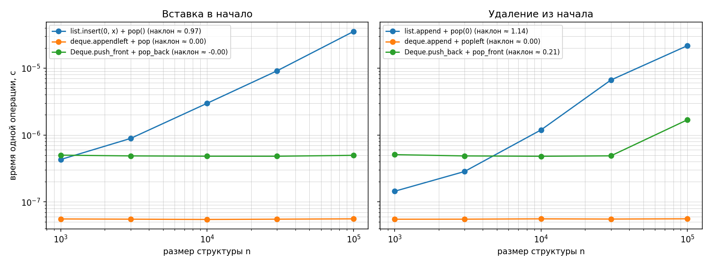
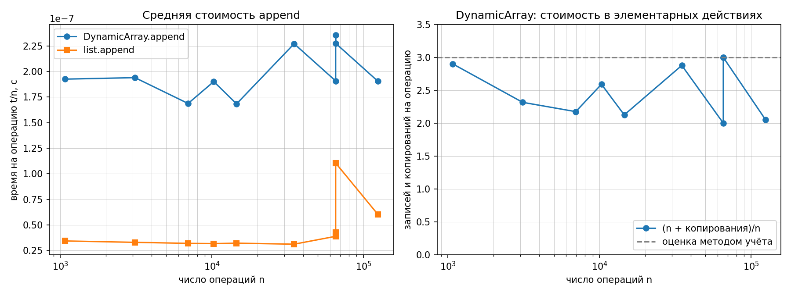

# Отчёт по ЛР 2. Рекурсивные функции; динамический массив, стек и дек

**Вариант 17** (seed генератора данных = 30 + 17 = **47**)
КИМ-02 — `M1-intro-and-basic-structures/kim-02-recursion-linear-structures.md`

Код: [`../lab02_recursion_structures.py`](../lab02_recursion_structures.py) · Протокол запуска: [`lab02_run.log`](lab02_run.log)

Работа выполнена на стартовой заготовке КИМ-02: каркас загрузки данных,
самопроверки, замеров и построения графиков оставлен без изменений, заполнены
только TODO — рекурсивные функции, `DynamicArray`, `Stack`, `Deque` и
собственные проверки инвариантов.

---

## 1. Условия эксперимента

| Параметр | Значение |
| --- | --- |
| Процессор | Intel64 Family 6 Model 158 Stepping 10 |
| ОС | Windows 11, 10.0.26200 |
| Python | CPython 3.11.9 (64 бит) |
| Таймер | `time.perf_counter()` |
| Прогрев | есть, первый запуск не учитывается |
| Повторов на точку | 5, берётся **медиана** |
| Данные | `data/generated`, вариант 17, seed 47, сверка по `manifest.json` |

```bash
python scripts/generate_data.py --variant 17 --only ops --out data/generated
python lab02_recursion_structures.py --variant 17 --out report
```

Данные варианта: `ops_stack.txt` и `ops_deque.txt` — по 100 000 операций,
`ops_append_sizes.txt` — 10 размеров серий `append`:
1075, 3107, 6966, 10291, 14549, 34888, **65536, 65537**, 65549, 124361.

---

## 2. Рекурсивные функции

### 2.1 Числа Фибоначчи: число вызовов

Счётчик учитывает каждый вход в функцию, включая базовые случаи и попадания в кэш.

| n | F(n) | `fib_naive` | 2·F(n+1) − 1 | `fib_memo` | 2n − 1 |
| ---: | ---: | ---: | ---: | ---: | ---: |
| 5 | 5 | 15 | 2·8 − 1 = 15 | 9 | 9 |
| 10 | 55 | 177 | 2·89 − 1 = 177 | 19 | 19 |
| 15 | 610 | 1 973 | 2·987 − 1 = 1 973 | 29 | 29 |
| 20 | 6 765 | 21 891 | 2·10 946 − 1 = 21 891 | 39 | 39 |
| 25 | 75 025 | 242 785 | 2·121 393 − 1 = 242 785 | 49 | 49 |
| 30 | 832 040 | 2 692 537 | 2·1 346 269 − 1 = 2 692 537 | 59 | 59 |

Измеренные счётчики **совпадают с формулами во всех строках**.

**Наивная рекурсия.** Пусть C(n) — число вызовов. Каждый вызов при n ≥ 2 —
это он сам плюс два поддерева: C(n) = 1 + C(n−1) + C(n−2), C(0) = C(1) = 1.
Для D(n) = C(n) + 1 получаем D(n) = D(n−1) + D(n−2), D(0) = D(1) = 2 —
та же рекуррентность, что у 2·F(n+1), с теми же начальными значениями. Значит,
**C(n) = 2·F(n+1) − 1 = Θ(φⁿ)**, φ ≈ 1,618. Проверка по таблице: при росте n
на 5 число вызовов растёт в 11,8; 11,1; 11,1; 11,1; 11,1 раза, а φ⁵ ≈ 11,09.

**Мемоизация.** Каждое значение k = 2, …, n вычисляется один раз и при этом
делает два рекурсивных вызова; базовые случаи и попадания в кэш новых вызовов
не порождают. С первым вызовом: **M(n) = 1 + 2(n − 1) = 2n − 1 = Θ(n)**.
При n = 30 это 59 вызовов вместо 2 692 537 — в 45 600 раз меньше. Словарь
`memo` создаётся заново на каждый внешний вызов и передаётся в рекурсию:
общий словарь по умолчанию сохранял бы результаты между вызовами и искажал счётчик.

Глубина стека у обеих версий — n кадров (путь fib(n) → fib(n−1) → … → fib(1)),
дополнительная память Θ(n).

### 2.2 Факториал

`factorial(n)` делает n + 1 вызов и n умножений: **Θ(n)** времени, глубина
рекурсии n + 1, память Θ(n). Базовое условие `n == 0`; мера завершения — n,
она строго уменьшается при каждом вызове. Проверено против `math.factorial`
при n = 0…20.

### 2.3 Ханойские башни

Перенос n дисков: n − 1 диск на вспомогательный стержень, самый большой — на
целевой, затем n − 1 диск поверх него. T(0) = 0, T(n) = 2·T(n−1) + 1, откуда

T(n) = 2ᵏ·T(n−k) + 2ᵏ − 1 = (при k = n) **2ⁿ − 1**.

`self_check` для n = 0, 1, 2, 3, 6, 7 (в том числе с другими именами стержней)
проигрывает записанные ходы и проверяет: число ходов равно 2ⁿ − 1 = 0, 1, 3, 7,
63, 127; каждый ход — пара разных стержней с непустого стержня; больший диск
ни разу не кладётся на меньший; в конце все диски на целевом стержне в
правильном порядке.

---

## 3. Линейные структуры

### 3.1 Реализация

- **`DynamicArray`** — буфер фиксированной ёмкости (список из `None`), рост ×2
  при `size == capacity`, счётчик `copies` перенесённых элементов. Методы
  `list.append/insert/pop` к буферу не применяются. `get`/`set` отвергают
  индексы вне `0 <= index < size`, включая отрицательные. Сжатие буфера в `pop`
  не реализовано (по КИМ необязательно), поэтому ёмкость только растёт.
- **`Stack`** — на `DynamicArray` только через публичный интерфейс
  (`append`, `pop`, `get`, `len`); `pop` и `peek` пустого стека — `IndexError`.
- **`Deque`** — двусвязный список с `head` и `tail`; все четыре операции концов
  Θ(1) без амортизации. При опустошении обнуляются **оба** конца — иначе ошибка
  проявилась бы только после повторного наполнения.

### 3.2 Операции у начала структуры

Время одной операции, с (размер структуры при замере постоянен):

| Операция | n = 10³ | 3·10³ | 10⁴ | 3·10⁴ | 10⁵ | Наклон |
| --- | ---: | ---: | ---: | ---: | ---: | ---: |
| `list.insert(0, x)` + `pop()` | 4,30e-07 | 8,87e-07 | 2,98e-06 | 9,09e-06 | 3,53e-05 | **0,97** |
| `deque.appendleft` + `pop` | 5,55e-08 | 5,51e-08 | 5,46e-08 | 5,51e-08 | 5,57e-08 | **0,00** |
| `Deque.push_front` + `pop_back` | 4,99e-07 | 4,87e-07 | 4,81e-07 | 4,81e-07 | 4,96e-07 | **0,00** |
| `list.append` + `pop(0)` | 1,44e-07 | 2,84e-07 | 1,19e-06 | 6,63e-06 | 2,17e-05 | **1,14** |
| `deque.append` + `popleft` | 5,50e-08 | 5,51e-08 | 5,57e-08 | 5,53e-08 | 5,58e-08 | **0,00** |
| `Deque.push_back` + `pop_front` | 5,08e-07 | 4,86e-07 | 4,80e-07 | 4,88e-07 | 1,69e-06 | 0,21 |



**Почему у `list` наклон ≈ 1, то есть Θ(n).** `list` в CPython — сплошной
массив из n ссылок. Вставка в позицию 0 сдвигает все n ссылок на ячейку
вправо, `pop(0)` — влево: на каждую операцию копируется 8n байт. При
n = 10⁵ это 800 КБ на одну вставку — отсюда 35 мкс. Увеличили n в 100 раз —
время выросло в 82 раза (при малых n заметна постоянная доля — накладные
расходы самого вызова).

**Почему у `collections.deque` и своего `Deque` наклон ≈ 0, то есть Θ(1).**
Сдвигать нечего. `collections.deque` — двусвязный список блоков по 64 ссылки:
`appendleft` пишет ссылку в крайний блок и раз в 64 операции заводит новый.
Свой `Deque` создаёт один узел и перевязывает две-три ссылки — их число не
зависит от n. При n = 10⁵ вставка в начало у `list` в 630 раз дороже, чем у
`collections.deque`, и в 71 раз дороже, чем у своего `Deque`.

**Выброс в последней строке и наклон 1,14 у `list.pop(0)`.** У
`Deque.pop_front` при n = 10⁵ одна точка в 3,5 раза выше остальных четырёх,
отсюда наклон 0,21; у `list.pop(0)` завышена точка n = 3·10⁴, отсюда 1,14
вместо ≈ 1. Это шум машины, а не рост: остальные точки рядов дека лежат на
одном уровне. Один замер здесь короткий — 1000 операций
по 50–500 нс, то есть 0,05–0,5 мс, — и все пять повторов точки идут подряд.
Помеха, которая длится дольше этой серии (например, смена частоты процессора),
задевает все пять повторов сразу, и медиана её не убирает. В четырёх повторных
прогонах выброс каждый раз оказывался в другой точке и другом ряду, а однажды
весь ряд `collections.deque` прошёл в ~4 раза медленнее, но так же ровно:

| Операция | Наклоны в 5 прогонах (первый — в отчёте) | Медиана |
| --- | --- | ---: |
| `list.insert(0, x)` | 0,97; 0,80; 0,91; 0,99; 1,01 | 0,97 |
| `deque.appendleft` | 0,00; 0,00; 0,01; 0,00; 0,01 | 0,00 |
| `Deque.push_front` | 0,00; 0,00; −0,33; −0,01; 0,00 | 0,00 |
| `list.pop(0)` | 1,14; 1,04; 1,09; 1,06; 1,08 | 1,08 |
| `deque.popleft` | 0,00; 0,00; 0,02; 0,00; 0,17 | 0,00 |
| `Deque.pop_front` | 0,21; −0,08; −0,21; 0,03; 0,01 | 0,01 |

Медианы наклонов — 1 у операций `list` и 0 у операций деков, как и следует
из асимптотики.

### 3.3 Операции варианта целиком

| Файл | Своя структура | Эталон | Во сколько раз медленнее |
| --- | --- | --- | ---: |
| `ops_stack.txt` | `Stack`: 2,97e-07 с | `list`: 8,10e-08 с | 3,7 |
| `ops_deque.txt` | `Deque`: 4,11e-07 с | `collections.deque`: 8,61e-08 с | 4,8 |

**Откуда постоянный множитель при одинаковой асимптотике.** `list` и
`collections.deque` написаны на C: операция — один вызов машинного кода.
Свои структуры написаны на Python: каждая операция — создание кадра вызова,
поиск атрибутов `self._head`, `self._size` и проверки в байт-коде; `Stack.push`
— это ещё и второй вызов, `DynamicArray.append`. `Deque` к тому же на каждый
`push` создаёт новый объект-узел, а на `pop` освобождает его, тогда как
`collections.deque` кладёт ссылку в заранее выделенный блок. Всё это меняет
константу, а не порядок роста. В чистом замере операций у начала разница
больше — около 9 раз (4,96e-07 против 5,57e-08 с при n = 10⁵), а на операциях варианта
её «разбавляют» общие для обеих сторон накладные расходы цикла `replay`:
поиск метода в словаре, распаковка кортежа, `try/except`.

---

## 4. Амортизированный анализ `append` методом учёта

### 4.1 Замер

| n | t/n `DynamicArray`, с | t/n `list`, с | `copies` | (n + copies)/n |
| ---: | ---: | ---: | ---: | ---: |
| 1 075 | 1,92e-07 | 3,43e-08 | 2 044 | 2,901 |
| 3 107 | 1,94e-07 | 3,30e-08 | 4 092 | 2,317 |
| 6 966 | 1,69e-07 | 3,20e-08 | 8 188 | 2,175 |
| 10 291 | 1,90e-07 | 3,17e-08 | 16 380 | 2,592 |
| 14 549 | 1,68e-07 | 3,22e-08 | 16 380 | 2,126 |
| 34 888 | 2,27e-07 | 3,12e-08 | 65 532 | 2,878 |
| 65 536 | 1,91e-07 | 3,89e-08 | 65 532 | **2,000** |
| 65 537 | 2,36e-07 | 4,28e-08 | 131 068 | **3,000** |
| 65 549 | 2,27e-07 | 1,10e-07 | 131 068 | 3,000 |
| 124 361 | 1,90e-07 | 6,04e-08 | 131 068 | 2,054 |



Время на один `append` не растёт с n: при увеличении n в 116 раз оно остаётся
в коридоре 1,7–2,4·10⁻⁷ с. Это и есть амортизированная **O(1)**: отдельный
`append` с ростом буфера стоит Θ(n), но в среднем по серии — константа.
Время следует за числом действий: у точек со стоимостью около 3 (n = 1075,
34888, 65537, 65549) t/n в среднем 2,2·10⁻⁷ с, у точек со стоимостью около 2
(6966, 14549, 65536, 124361) — 1,8·10⁻⁷ с. Нагляднее всего пара 65 536 → 65 537:
n выросло на единицу, стоимость — с 2,000 до 3,000, время — с 1,91 до 2,36·10⁻⁷ с.
У `list.append` при n = 65 549 — одиночный выброс 1,1·10⁻⁷ с, тот же шум
машины, что в п. 3.2.

### 4.2 Метод учёта (банковский метод)

**Единица стоимости** — монета: одна запись элемента в ячейку или одно
копирование элемента при росте буфера. Фактическая стоимость `append` —
1 монета, если буфер не заполнен, и 1 + size монет, если заполнен (копирование
size элементов плюс запись).

**Назначаем каждому `append` плату 3 монеты:** 1 сразу тратится на запись
своего элемента, 2 откладываются в копилку — это «кредит» элемента.

**Кредита хватает на каждый рост.** Рост m → 2m происходит при size = m и
копирует m элементов.

- Первый рост 4 → 8: в копилке взносы четырёх `append` — 4·2 = 8 монет,
  копирование стоит 4.
- Рост m → 2m при m ≥ 8: после предыдущего роста (m/2 → m) добавлено m/2
  элементов, они внесли m/2 · 2 = m монет — ровно столько, сколько стоит
  копирование m элементов.

Каждый рост оплачен полностью, значит копилка никогда не уходит в минус, а
фактическая стоимость любых n операций не больше внесённой платы:
**n + copies ≤ 3n, то есть (n + copies)/n ≤ 3 = O(1)**.

**Точная формула для начальной ёмкости 4.** При 2ᵏ < n ≤ 2ᵏ⁺¹ (k ≥ 2)
произошли росты с ёмкостей 4, 8, …, 2ᵏ:

copies = 4 + 8 + … + 2ᵏ = 2ᵏ⁺¹ − 4 < 2n,

поэтому **2 − 4/n ≤ (n + copies)/n < 3**. Все значения `copies` в таблице 4.1
совпадают с этой формулой (например, при n = 34 888: 2¹⁶ − 4 = 65 532).

**Сопоставление с `copies` на размерах варианта.** Остаток в копилке после n
операций равен 2n − copies:

| n | 1 075 | 3 107 | 6 966 | 10 291 | 14 549 | 34 888 | 65 536 | 65 537 | 65 549 | 124 361 |
| --- | ---: | ---: | ---: | ---: | ---: | ---: | ---: | ---: | ---: | ---: |
| 2n − copies | 106 | 2 122 | 5 744 | 4 202 | 12 718 | 4 244 | 65 540 | **6** | 30 | 117 654 |

Копилка везде неотрицательна. Минимум — **6 монет** сразу после роста при
n = 65 537: это c₀ + 2 = 4 + 2, где c₀ = 4 — начальная ёмкость (4 монеты
остаются после первого роста, 2 вносит сам `append`, вызвавший рост), ровно как
предсказывает анализ. Это же условие (2·append − copies ≥ 0) проверяется в
коде после каждой из 100 000 операций варианта — см. п. 5, И3.

**Почему у 2ᵏ и 2ᵏ + 1 стоимость различается почти на 1.** При n = 65 536 = 2¹⁶
буфер заполнен ровно до конца, последний рост ещё не случился: copies =
2¹⁶ − 4 = 65 532, стоимость 2,000. Следующий, 65 537-й `append` находит буфер
полным и копирует сразу все 65 536 элементов: copies = 2¹⁷ − 4 = 131 068,
стоимость 3,000. Разница — 65 536 копирований на ~65 536 операций, то есть
почти ровно 1 на операцию. В терминах копилки: перед ростом в ней 65 540
монет, после — 6; кредит, накопленный всей серией, потрачен одним махом.
Сразу после роста средняя стоимость максимальна (≈ 3), а к следующему росту
опускается до ≈ 2 — отсюда «пила» на правом графике.

---

## 5. Верификация (методика `docs/ai-verification.md`)

Все проверки собраны в `self_check()` и выполняются до замеров; все разделы
проходят. Собственные проверки оформлены явными исключениями через функцию
каркаса `expect` (`SelfCheckError`), а не `assert`: `assert` отключается при
запуске `python -O`. Прогон под `python -O` выполнен — все разделы проходят.

### Шаг 1. Инварианты

Разделы каркаса: рост ёмкости ×2 и `copies` после каждого из 100 `append`
(границы 4, 8, 16, 32, 64), LIFO стека, порядок элементов дека, допустимость
ходов Ханойских башен. Собственные проверки (`check_invariants`):

| № | Инвариант | Где проверяется |
| --- | --- | --- |
| И1 | `size <= capacity` | после каждой из 100 000 операций `ops_stack.txt`, выполненных над `DynamicArray` |
| И2 | ёмкость меняется только ×2 и только у заполненного буфера | там же; ёмкость проходит границы 4, 8, …, 4096 и доходит до 8192 |
| И3 | копилка метода учёта не в минусе: 2·append − copies ≥ 0 | там же; в конце 83 210 монет |
| И4 | FIFO в обе стороны: `push_back` + `pop_front` и `push_front` + `pop_back` | 1000 элементов, по два цикла опустошения и повторного наполнения |

Что проверки действительно ловят дефекты, проверено подменой реализации:
рост ёмкости на +1 и ×3 нарушает И2 уже на 7-й операции варианта, а `pop_front`,
берущий элемент с хвоста, нарушает И4 на первом же извлечении.

### Шаг 2. Репрезентативные тесты

- **пустая структура:** `get`, `set`, `pop` пустого массива, `pop`/`peek`
  пустого стека, `pop_front`/`pop_back` пустого дека — `IndexError`;
- **один элемент:** все 16 сочетаний концов дека для одного элемента с повторным
  наполнением;
- **опустошение и повторное наполнение:** массив, стек и дек, по два цикла;
- **серия через границу роста ёмкости:** 100 `append` (границы 4…64), 20 `push`
  в стек (границы 4, 8, 16), операции варианта (границы до 4096);
- **граница индексов:** `get`/`set` с индексами size, capacity − 1, capacity,
  −1, −100.

### Шаг 3. Сверка с эталоном

| Проверяемое | Эталон | Входы |
| --- | --- | --- |
| `Stack` | `list` | случайная серия 3000 операций; **100 000 операций варианта** |
| `Deque` | `collections.deque` | случайная серия 5000 операций; **100 000 операций варианта** |
| `factorial` | `math.factorial` | n = 0…20 |
| `fib_naive` | итеративный ряд Фибоначчи | n = 0…20 |
| `fib_memo` | итеративный ряд Фибоначчи | n = 0, 1, 2, 10, 30, 90 |

После каждой операции сверяются результат и длина. В данных варианта структуры
многократно опустошаются: стек — 59 раз (максимальный размер 4760), дек —
69 раз (максимум 4579); операций над пустой структурой — 58 и 49. На них своя
реализация и эталон одинаково выдают `IndexError`. Расхождений нет.

### Шаг 4. Оценка сложности

Аналитические оценки подтверждены замерами: счётчики вызовов совпадают с
формулами C(n) = 2·F(n+1) − 1 и M(n) = 2n − 1; стоимость `append` ограничена
3 и не растёт с n; операции у начала `list` растут линейно, у деков — нет.
Типичный «невидимый» дефект — рост ёмкости на константу вместо удвоения —
даёт верные ответы, но Θ(n) на операцию; его ловят инвариант И2 и счётчик
`copies`.

**Вывод о применимости: принять.**

---

## 6. Выводы

1. Наивная рекурсия для чисел Фибоначчи делает 2·F(n+1) − 1 = Θ(φⁿ) вызовов,
   мемоизация — 2n − 1 = Θ(n); при n = 30 это 2 692 537 против 59. Счётчики
   совпадают с формулами на всех шести n.
2. Ханойские башни требуют 2ⁿ − 1 ходов; записанные ходы допустимы, что
   проверено их проигрыванием.
3. `DynamicArray` с ростом ×2 держит size ≤ capacity; средняя стоимость
   `append` на размерах варианта — от 2,000 до 3,000 действий и 1,7–2,4·10⁻⁷ с
   на операцию, независимо от n: амортизированная O(1).
4. Метод учёта с платой 3 монеты показывает, что копилка никогда не уходит в
   минус, поэтому (n + copies)/n < 3. Измеренные `copies` совпадают с формулой
   2ᵏ⁺¹ − 4, остаток копилки на размерах варианта — от 6 до 117 654 монет.
   Скачок стоимости с 2,000 до 3,000 между n = 65 536 и 65 537 — это рост буфера,
   оплаченный кредитом всей предыдущей серии.
5. Операции у начала `list` стоят Θ(n) (наклон ≈ 1): сдвигаются все элементы.
   У `collections.deque` и своего `Deque` — Θ(1) (наклон ≈ 0). При n = 10⁵
   вставка в начало `list` в 630 раз дороже, чем у `collections.deque`.
6. Свои структуры в 3,7 и 4,8 раза медленнее стандартных на операциях варианта при той
   же асимптотике: они на Python, стандартные — на C; `Deque` к тому же
   создаёт объект на каждый узел.
